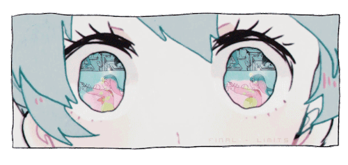
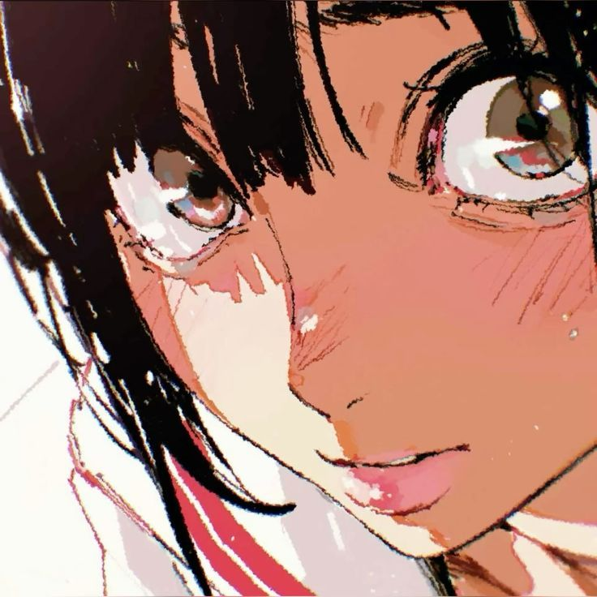
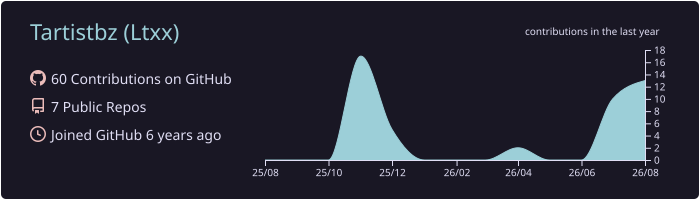
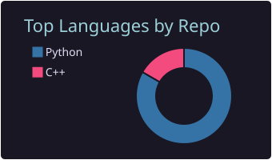
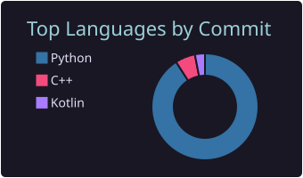
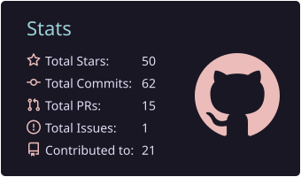
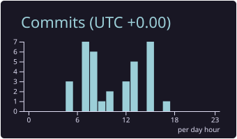

<!--
Image source: sleepy-archive/sleepy-archive/assets
Copied locally at the owner's request. Replace these files if you have your own licensed anime assets.
-->

<p align="center">
  <a href="https://git.io/typing-svg">
    
  </a>
</p>

<p align="center">
  
</p>

<p align="center">
  <a href="#中文模式">中文</a>  ·  <a href="#english-mode">English</a>
</p>

<details open>
  <summary id="中文模式">中文模式 / Chinese</summary>

<div>
  

```text
Tartistbz@github
-------------------------
昵称：Tartistbz
方向：无人机 / 机器人 / AI Agent
技术：PX4 / APM / ROS
```

  <br clear="left" />

  <p>这里是 Tartistbz 的小小开发房间，主要折腾无人机、机器人系统和 AI Agent。</p>
</div>

</details>

<details>
  <summary id="english-mode">English mode</summary>

<div>
  

```text
Tartistbz@github
-------------------------
Name: Tartistbz
Focus: drones / robotics / AI agents
Stack: PX4 / APM / ROS
```

  <br clear="left" />

  <p>Welcome to Tartistbz's little development room. I work on drones, robotics systems, and AI agents.</p>
</div>

</details>

<br />

<p align="center">
  
</p>

<br />

<h2 align="center">CONTACT ME / 联系我</h2>

<div>
  

  <details open>
    <summary>中文</summary>
    <p>项目交流请通过邮箱联系我。</p>
  </details>

  <details>
    <summary>English</summary>
    <p>For project discussions, please reach me by email.</p>
  </details>
</div>

<br clear="left" />

<p align="center">
  <a href="mailto:ltxx01514@outlook.com">
    
  </a>
</p>

<br />

<h2 align="center">GITHUB STATS / GitHub 数据</h2>

<p align="center">
  
</p>

<table align="center">
  <tr>
    <td width="50%">
      
    </td>
    <td width="50%">
      
    </td>
  </tr>
  <tr>
    <td width="50%">
      
    </td>
    <td width="50%">
      
    </td>
  </tr>
</table>

<br />

<p align="center">
  <sub>Thanks for visiting / 感谢来访</sub>
</p>
