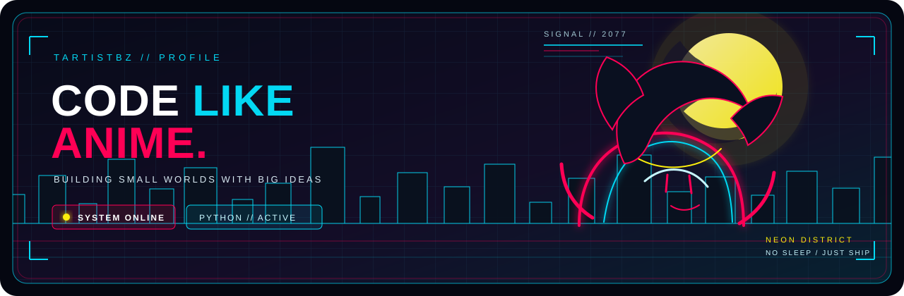
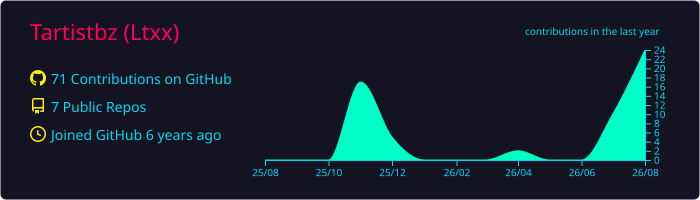
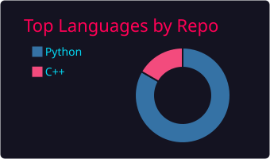
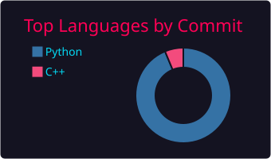
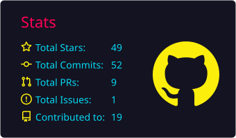
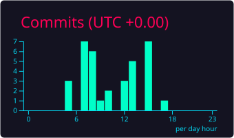

<p align="center">
  
</p>

<h1 align="center">Tartistbz</h1>

<p align="center">
  <strong>building small tools, strange experiments, and useful little worlds.</strong><br />
  <code>Python</code> <code>automation</code> <code>experiments</code> <code>late-night commits</code>
</p>

<p align="center">
  <a href="https://github.com/Tartistbz?tab=repositories">
    
  </a>
  <a href="https://github.com/Tartistbz?tab=followers">
    
  </a>
  
</p>

<br />

<table align="center">
  <tr>
    <td width="55%" valign="top">

### SYSTEM // ONLINE

> I like turning messy ideas into small things that actually work.

- Main language: **Python**
- Current mode: **learn, build, ship, repeat**
- Preferred interface: **clean code with a little neon**
- Status: **probably debugging something**

    </td>
    <td width="45%" valign="top">

### LOADOUT

```text
 [##########] curiosity
 [#########-] persistence
 [#######---] sleep
 [########--] coffee
```

    </td>
  </tr>
</table>

<br />

<h2 align="center">NEON TELEMETRY</h2>

<p align="center">
  
</p>

<table align="center">
  <tr>
    <td width="50%">
      
    </td>
    <td width="50%">
      
    </td>
  </tr>
  <tr>
    <td width="50%">
      
    </td>
    <td width="50%">
      
    </td>
  </tr>
</table>

<br />

<p align="center">
  
</p>
